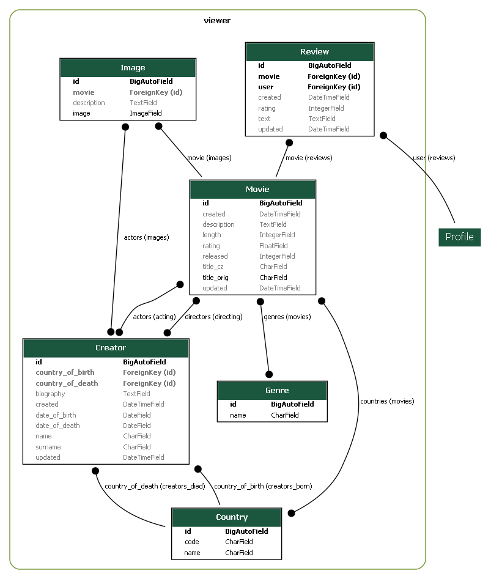

# SDAcademy - PythonRemoteCZ23 - Hollymovies project

## Installation and setup

```bash
pip install django
```

```bash
pip freeze > requirements.txt
```

Create Django project:
```bash
django-admin startproject hollymovies .
```

## Project structure
- hollymovies - settings of our project
  - `__init__.py` - necessary to make this directory as module
  - `asgi.py` - we will not use it
  - `settings.py` - setting of our project
  - `urls.py` - in this file we define url path in our project
  - `wsgi.py` - we will not use it

## Run server
Default on port 8000:
```bash
python manage.py runserver
```

We can change port number:
```bash
python manage.py runserver 8001
```

## Start new application
```bash
python manage.py startapp viewer
```
- viewer - our first application
  - migrations - directory with migrations scripts (changes in database schema)
  - `__init__.py` - necessary to make this directory as module
  - `admin.py` - setting of administration panel
  - `apps.py` - setting of the application - we don't need to change it
  - `models.py` - IMPORTANT - includes definition of models in database
  - `tests.py` - includes tests
  - `views.py` - IMPORTANT - includes views (business logic)
 
## Registration of new application
In file `./holymovies/settings.py` add application to the list `INSTALLED_APPS`

## Application `viewer`

### Database (`models`)
We can generate ER diagram in PyCharm PRO:


Or we can use extensions:
- download Graphviz: https://graphviz.org/download/
- install `pip install graphviz`
- install `pip install pyparsing pydot`
- install `pip install django-extensions`
- add `django_extensions` to `setting.py` to `ÌNSALLED_APPS`
- to `setting.py` add:
```python
GRAPH_MODELS = {
    'all_applications': True,
    'graph_models': True
}
```
- run command `python manage.py graph_models -a > ./files/erd.dot`
- run command `python manage.py graph_models --pydot -a -g -o ./files/erd.png` for the whole project
- or `python manage.py graph_models viewer --pydot -g -o ./files/erd_viewer.png` for only one application
  - in `settings.py` will be:
```python
GRAPH_MODELS = {
    'app_labels': ['viewer'],
}  
 ```


### Migration of database
In case of any change of our model (in `models.py` file), we must make migration.
It has two steps:
1. We generate migration script (`viewer/migrations`):
```bash
python manage.py makemigrations
```

2. We make changes in database:
```bash
python manage.py migrate
```

### DUMP/LOAD database
Export of database:
```bash
pip install django-dump-load-utf8
```

Add `django_dump_load_utf8` to `INSTALLED_APPS` in `setting.py`.

DUMP:
```bash
python manage.py dumpdatautf8 viewer --output ./files/fixtures.json
```

LOAD:
```bash
python manage.py loaddatautf8 ./files/fixtures.json
```

## Administration panel
We must create superuser: `python manage.py createsuperuser`

## Tips for Final project
- for team work:
  - one member of the team creates project
  - this member creates git repository and share with other members (settings -> Collaborators -> Add people...)
  - other members makes git clone
  - all members must have same settings of indentation in Pycharm
- in the path of project files should not be spaces nor diacritics
- all installed modules must be in same version for all team members (file requirements.txt)
  ```bash
  pip freeze > requirements.txt
  ```
- `settings.py` - move SECRET_KEY to file ignored by git
- working with GIT:
  - from `master` create new branch `develop` 
  - from `develop` create new branches for new features/tests/...
  - if all changes in working branch has been done, merge changes to `develop`
  - in branch `develop` run tests
  - if all tests passes merge all changes to `master`
  - in `master` don't make any changes, just merge
- create `readme.md` file
  - includes project title
  - project description
  - (optional) ER diagram
  - (optional) screenshots