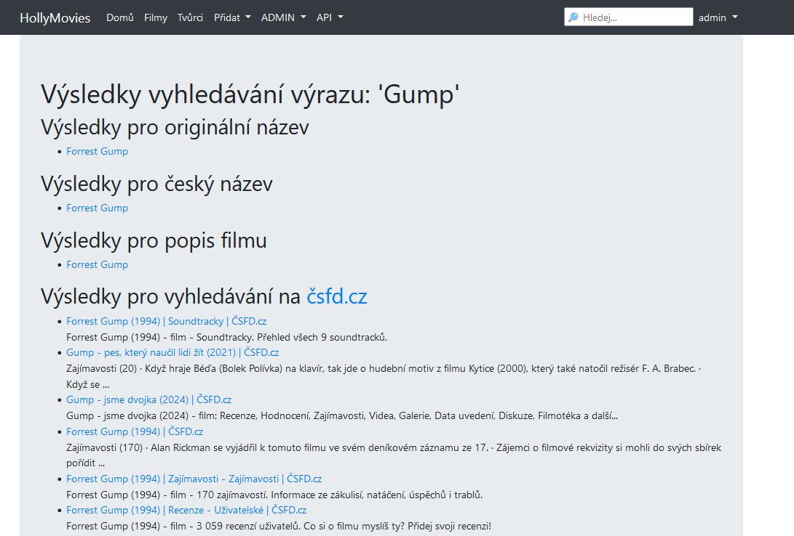

# SDAcademy - PythonRemoteCZ23 - Hollymovies project

## Installation and setup

```bash
pip install django
```

```bash
pip freeze > requirements.txt
```

Create Django project:
```bash
django-admin startproject hollymovies .
```

## Project structure
- hollymovies - settings of our project
  - `__init__.py` - necessary to make this directory as module
  - `asgi.py` - we will not use it
  - `settings.py` - setting of our project
  - `urls.py` - in this file we define url path in our project
  - `wsgi.py` - we will not use it

## Run server
Default on port 8000:
```bash
python manage.py runserver
```

We can change port number:
```bash
python manage.py runserver 8001
```

## Start new application
```bash
python manage.py startapp viewer
```
- viewer - our first application
  - migrations - directory with migrations scripts (changes in database schema)
  - `__init__.py` - necessary to make this directory as module
  - `admin.py` - setting of administration panel
  - `apps.py` - setting of the application - we don't need to change it
  - `models.py` - IMPORTANT - includes definition of models in database
  - `tests.py` - includes tests
  - `views.py` - IMPORTANT - includes views (business logic)
 
## Registration of new application
In file `./holymovies/settings.py` add application to the list `INSTALLED_APPS`

## Application `viewer`

### Database (`models`)
We can generate ER diagram in PyCharm PRO:


Or we can use extensions:
- download Graphviz: https://graphviz.org/download/
- install `pip install graphviz`
- install `pip install pyparsing pydot`
- install `pip install django-extensions`
- add `django_extensions` to `setting.py` to `ÌNSALLED_APPS`
- to `setting.py` add:
```python
GRAPH_MODELS = {
    'all_applications': True,
    'graph_models': True
}
```
- run command `python manage.py graph_models -a > ./files/erd.dot`
- run command `python manage.py graph_models --pydot -a -g -o ./files/erd.png` for the whole project
- or `python manage.py graph_models viewer --pydot -g -o ./files/erd_viewer.png` for only one application
  - in `settings.py` will be:
```python
GRAPH_MODELS = {
    'app_labels': ['viewer'],
}  
 ```


### Migration of database
In case of any change of our model (in `models.py` file), we must make migration.
It has two steps:
1. We generate migration script (`viewer/migrations`):
```bash
python manage.py makemigrations
```

2. We make changes in database:
```bash
python manage.py migrate
```

### DUMP/LOAD database
Export of database:
```bash
pip install django-dump-load-utf8
```

Add `django_dump_load_utf8` to `INSTALLED_APPS` in `setting.py`.

DUMP:
```bash
python manage.py dumpdatautf8 viewer --output ./files/fixtures.json
```

LOAD:
```bash
python manage.py loaddatautf8 ./files/fixtures.json
```

## Administration panel
We must create superuser: `python manage.py createsuperuser`

## Queries
### .all()
Vrací kolekci všech nalezených záznamů z tabulky Movie
`Movie.objects.all()`  

### .get()
Vrátí jeden nalezený záznam (první, který splňuje podmínky).
`Movie.objects.get(pk=1)`

### .filter()
Vrací kolekci záznamů, které splňují podmínky),
`Movie.objects.filter(pk=1)`

`Movie.objects.filter(title_orig="The Green Mile")`

`Movie.objects.filter(released=1995)`

`Movie.objects.filter(released__gt=1990)` -- `__gt` => "větší než" (greater then)

`Movie.objects.filter(released__gte=1990)` -- `__gte` => "větší rovno" (greater then equal)

`Movie.objects.filter(released__lt=1990)` -- `__lt` => "menší než" (less then)

`Movie.objects.filter(released__lte=1990)` -- `__lte` => "menší rovno" (less then equal)

`drama = Genre.objects.get(name="Drama")`

`Movie.objects.filter(genres=drama)`

`Movie.objects.filter(genres=Genre.objects.get(name="Drama"))`

`Movie.objects.filter(genres__name="Drama")`

`Movie.objects.filter(title_orig__contains="Gump")`

`Movie.objects.filter(title_orig__in=["Forrest Gump", "Se7en"])`

`Movie.objects.filter(released=1995)`

`Movie.objects.exclude(released=1995)`

Test, zda daný záznam existuje:
`Movie.objects.filter(released=1995).exists()`

Spočítáme počet vyhovujících záznamů:
`Movie.objects.filter(released=1994).count()`

Uspořádání výsledků podle:
`Movie.objects.all()`

`Movie.objects.all().order_by('released')` -- uspořádání vzestupně

`Movie.objects.all().order_by('-released')` -- uspořádání sestupně

## Data manipulation

### CREATE
`Genre.objects.create(name='Dokumentární')`

```python
genre = Genre(name='Sci-fi')  # create object in Python
genre.save()                  # put it in the database
```

### UPDATE
` Movie.objects.filter(pk=5).update(rating=90)`

```python
movie = Movie.objects.get(pk=5)
movie.rating = 92
movie.save()
```

### DELETE
`Genre.objects.filter(name='Dokumentární').delete()`

## Tests
In every application we have a `tests.py` file where we can put tests.
It is possible to create additional files with tests, the name should ideally start with `test*.py`.

The command for testing is: `python manage.py test` will run all tests in files starting with `test`.

The test command `python manage.py test viewer.test_models` will run all the tests in the file
`test_models.py` in the `viewer` application.

Basic tests are run on a virtual database that has the same schema as ours defined
database in `models.py`, but it is empty and independent of the actual database.

### GUI tests
We will install selenium (for working with the website): `pip install selenium`

The server must be running for operation.

ATTENTION: Here we are already working with a real project, i.e. with a real database.

### Tips for testing
If the relation is ManyToMany then a list is specified: `'genres': ['1', '2']`.

All inputs for the tested forms must be text.

## Images
We will install the Pillow package: `python -m pip install Pillow`

In `models.py` we use `ImageField`: `image = ImageField(upload_to='images/', default=None, null=False, blank=False)`

Make migrations.

In `settings.py` we add paths:
```python
MEDIA_ROOT = BASE_DIR  #os.path.join(BASE_DIR, '')
MEDIA_URL = 'images/'
```

In `urls.py` we add to the end of the path list:
`+ static(settings.MEDIA_URL, document_root=settings.MEDIA_ROOT)`

We display the image in the template using ``

For the file upload form we need to define:
`<form method="POST" enctype="multipart/form-data">`

## API
We will create a new application for the API: `python manage.py startapp api`

In `setting.py` we put `api` in `INSTALLED_APPS`.

We will install the rest framework: `pip install djangorestframework`.

In the `setting.py` file we put `rest_framework` in `INSTALLED_APPS`.

Since the api returns a file, we don't need to deal with templates.

We create a serializer in the `api.serializers.py` file:
```python
class MovieListSerializer(serializers.ModelSerializer):
    class Meta:
        model = Movie
        fields = '__all__'
```

We create a view in `api.views.py`:
```python
class Movies(mixins.ListModelMixin, generics.GenericAPIView):
    queryset = Movie.objects.all()
    serializer_class = MovieListSerializer

    def get(self, request, *args, **kwargs):
        return self.list(request, *args, **kwargs)
```

We put a new path in `urls.py`:
`path('api/movies/', api.views.Movies.as_view()),`

It is advisable to limit work with the API only to users who have authorization.
In `settings.py` we insert:
```python
REST_FRAMEWORK = {
    'DEFAULT_PERMISSION_CLASSES': [
        'rest_framework.permissions.DjangoModelPermissionsOrAnonReadOnly',
    ]
}
```

## Google search API
The application can search using the Google API on the [csfd.cz](https://www.csfd.cz/) page.
To work with the Google API, you need your own `API key` and `cx`, 
which you need to add to the constants in the `hollymovies/secret_key.py` file:
```python
GOOGLE_API_KEY = 'your_api_key'
GOOGLE_CX = 'your_cx'
```
this information is not shared on git, so you need to add your own Google access keys. 
You can find out how on this page: [Identify your application to Google with API key](https://developers.google.com/custom-search/v1/introduction#identify_your_application_to_google_with_api_key)



## Tips for Final project
- for team work:
  - one member of the team creates project
  - this member creates git repository and share with other members (settings -> Collaborators -> Add people...)
  - other members makes git clone
  - all members must have same settings of indentation in Pycharm
- in the path of project files should not be spaces nor diacritics
- all installed modules must be in same version for all team members (file requirements.txt)
  ```bash
  pip freeze > requirements.txt
  ```
- `settings.py` - move SECRET_KEY to file ignored by git
- working with GIT:
  - from `master` create new branch `develop` 
  - from `develop` create new branches for new features/tests/...
  - if all changes in working branch has been done, merge changes to `develop`
  - in branch `develop` run tests
  - if all tests passes merge all changes to `master`
  - in `master` don't make any changes, just merge
- create `readme.md` file
  - includes project title
  - project description
  - (optional) ER diagram
  - (optional) screenshots